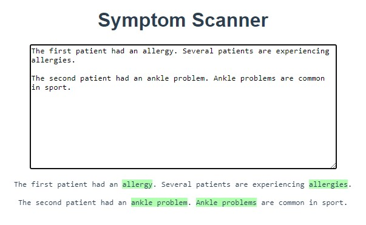

## Description:

A VueJS + NestJS application that compares text input to some common medical symptoms scraped from the web. 
https://www.nhsinform.scot/symptoms-and-self-help/a-to-z/

## Design choices:

- Using REST rather than GraphQL. Owing to the minimalistic nature of the application.

- The "Cheerio" package for webscraping. It has a familiar jQuery like syntax and is easy to use.

- The "Natural" package for NLP.

- Typescript for the Vue.js client.

## If more time were available:

- I would have created a third service written in Python to take
  advantage of the NLTK natural language processing package. This
  would have made more complex matches possible through operations
  like chunking and lemmatizing.

- Included the link to the symptom's page in the response payload.

- Spent more time on testing.

- Styling.

## Installation:

1. Build and run the containers:

```sh
    docker-compose up --build
```

2. Navigate to http://localhost:8080/ in your browser.
3. To remove the containers:

```sh
    docker-compose down
```

## List of symptoms:

    'Allergies',
    'Ankle problems',
    'Back problems',
    'Bowel incontinence',
    'Calf problems',
    'Catarrh',
    'Chest pain',
    'Chilblains',
    'Chronic pain',
    'Living well with coeliac disease',
    'Cold sore',
    'Constipation',
    'Living well with COPD',
    'Cough',
    'Dehydration',
    'Dizziness (Lightheadedness)',
    'Dry mouth',
    'Earache',
    'Elbow problems',
    'Fever in adults',
    'Fever in children',
    'Flatulence',
    'Flu',
    'Foot problems',
    'Hay fever',
    'Headaches',
    'Hearing loss',
    'Heart palpitations',
    'Hip problems',
    'Indigestion',
    'Itching',
    'Itchy bottom',
    'Urinary incontinence',
    'Knee problems',
    'Migraine',
    'Mouth ulcer',
    'Neck problems',
    'Nosebleed',
    'Skin rashes in children',
    'Shortness of breath',
    'Shoulder problems',
    'Sore throat',
    'Stomach ache and abdominal pain',
    'Swollen glands',
    'Testicular lumps and swellings',
    'Thigh problems',
    'Tinnitus',
    'Toothache',
    'Urinary tract infection (UTI)',
    'Vertigo',
    'Vomiting in adults',
    'Warts and verrucas',
    'Wrist, hand and finger problems'
